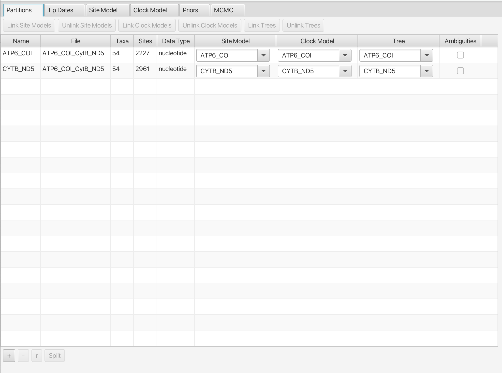
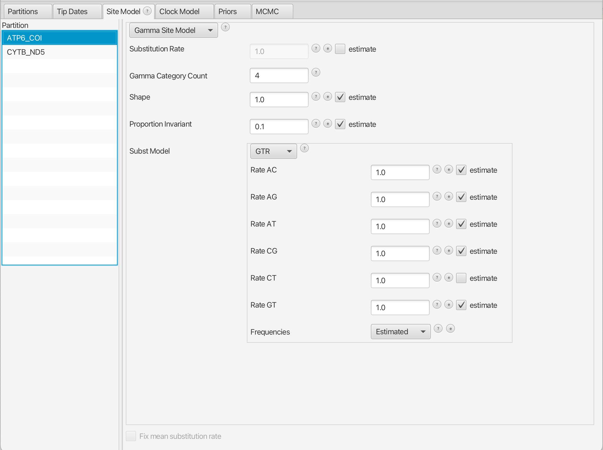
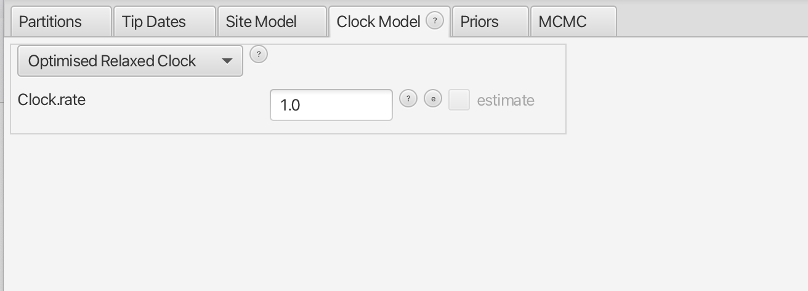
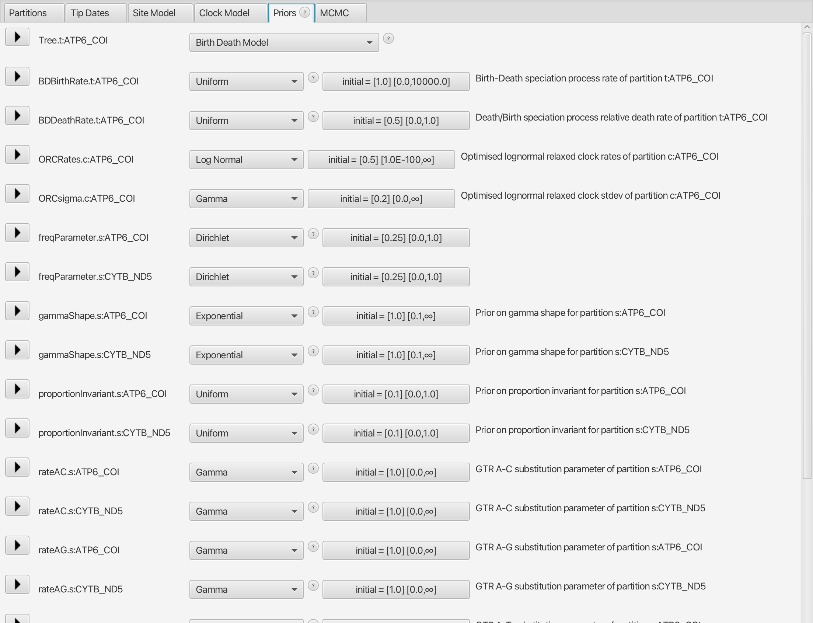
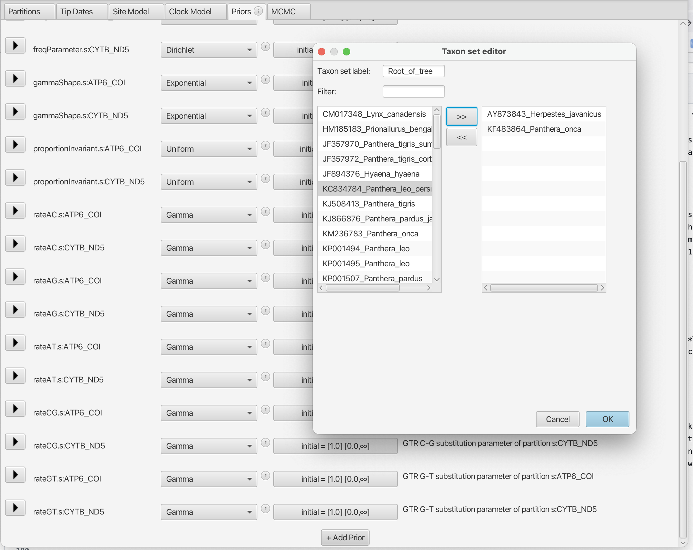
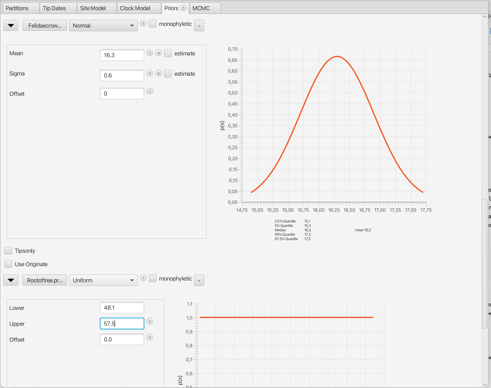
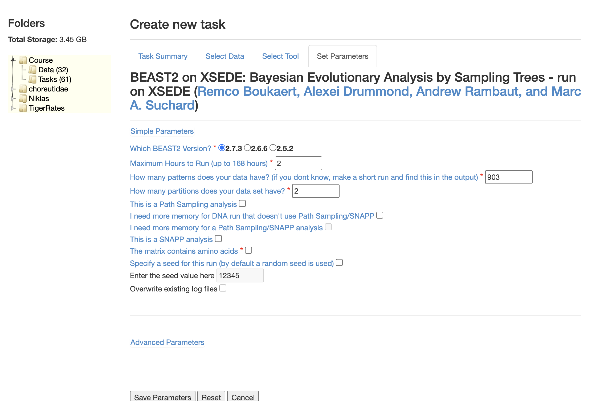
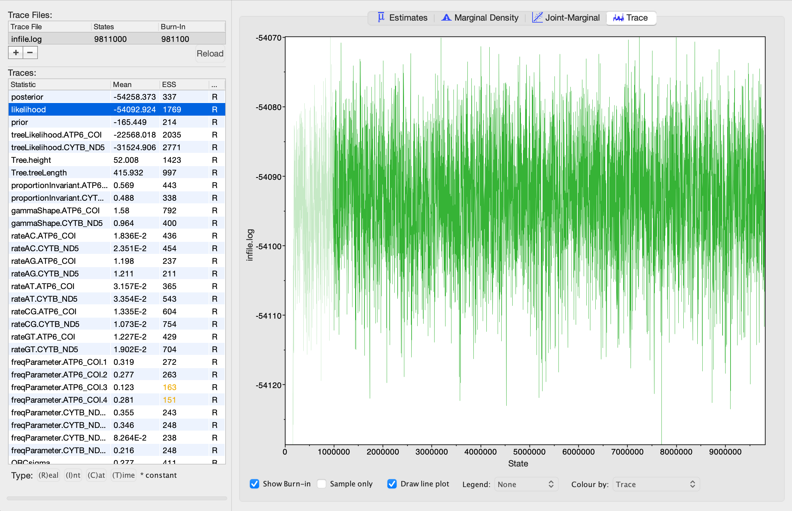
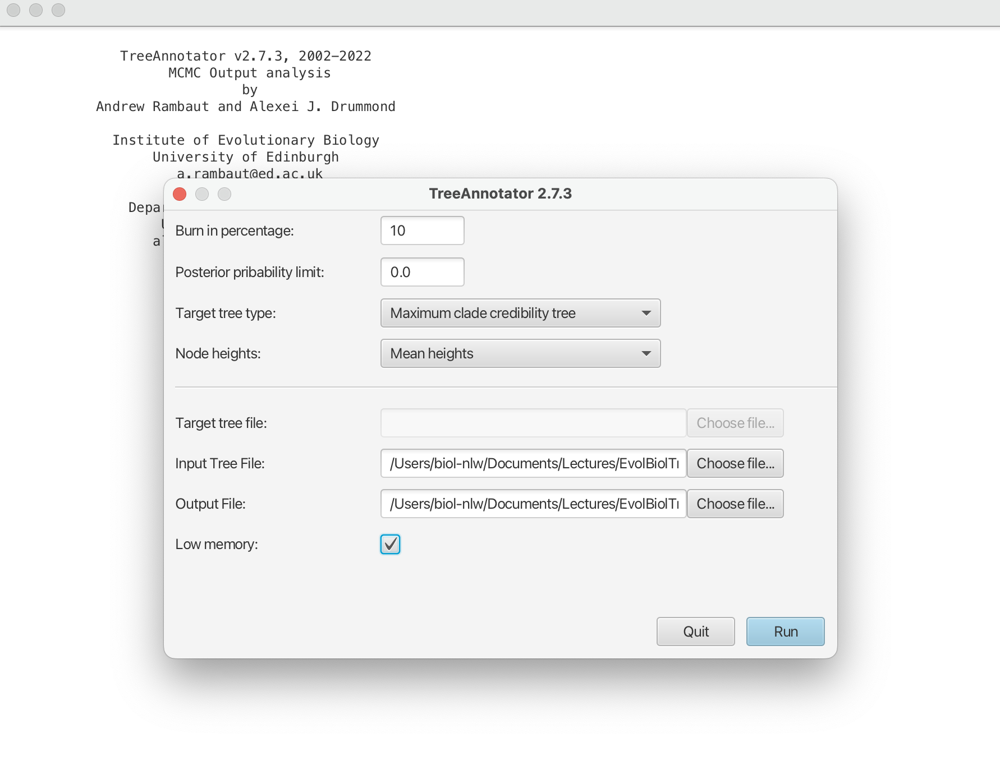

# Divergence Time Inference with BEAST2

In previous days we saw how to prepare molecular datasets, how to find the best partitioning scheme and best substitution model; and we finally saw how to infer phylogenies using **Bayesian** and **Maximum Likelihood** approaches. We very briefly saw how to interpret the obtained trees and how to check the obtained results.

In this tutorial, we will demonstrate how time-calibrated phylogenies can be inferred using a Bayesian approach. For this we will use the program BEAST2 (check that you have version 2.7.3 or higher), which is a cross-platform program for Bayesian phylogenetic analysis of molecular sequences. BEAST2 includes a graphical user-interface for setting up standard analyses and a suit of programs for analysing the results.

The data used in this tutorial is the concatenated alignment generated before `ATP6_COI_CytB_ND5.nex`. The first step will be to modify the partition information in your text editor. From the previous tutorial, we have a MrBayes block at the end of our file. We will keep this block, but make it invisible to BEAST2 by putting it in square brackets:

```
[begin mrbayes;
  charset ATP6_COI = 1 - 681  682 - 2226;
  charset CYTB_ND5 = 2227 - 3366  3367 - 5187;

  Partition ModelFinder = 2:ATP6_COI, CYTB_ND5;
  set partition=ModelFinder;

  set autoclose=yes;

  lset applyto=(1) nst=6 rates=invgamma;
  lset applyto=(2) nst=6 rates=invgamma;
  prset applyto=(all) ratepr=variable brlensp=unconstrained:Exp(100.0) shapepr=exp(1.0) tratiopr=beta(2.0,1.0);
  unlink statefreq=(all) revmat=(all) shape=(all) pinvar=(all) tratio=(all);
  mcmc ngen=20000 printfreq=100 samplefreq=100 nchains=4 nruns=2 savebrlens=yes [temp=0.11];
  sump relburnin=yes [no] burninfrac=0.25 [2500];
  sumt relburnin=yes [no] burninfrac=0.25 [2500] contype=halfcompat [allcompat];
end;]
```
BEAST2 has a very limited set of substitution models, much like MrBayes, so we will use the information from the ModelFinder results from the third analysis (with `-mset mrbayes`). Now add a new block after the MrBayes block with just the information about the partitions, like this:

```
begin sets;

  charset ATP6_COI = 1 - 681  682 - 2226;
  charset CYTB_ND5 = 2227 - 3366  3367 - 5187;


end;

```

Save it as `FelidaeBEAST.nex`. Now we want to create **BEAST**'s command file which is a `*.xml` file. This is done using the program **BEAUti**.

Open **BEAUti** from the BEAST2 folder, and import the alignment. To do so, click on **"File"** and click on **"Import Alignment"**. Find your alignment file called `FelidaeBEAST.nex` and import it. The BEAUti window should then look as shown in the screenshot below.

<p align="center"></p>

The BEAUti interface has six different tabs, of which (at the top of the window) the first one "Partitions" is currently selected. First you need to specify settings regarding the partitioning in the currently open tab. 

Select the 2 partitions rows and click on **Link Trees** and **Link Clock Models** near the top of the BEAUti window. This will force BEAST2 to use all partitions together to infer a tree or a clock model. However, we will let BEAST2 use a separate substitution model for the two partitions. In effect this means we believe the two partitions are evolving at their own mutation rates between nucleotides, but that they are evolving along the same tree at the same speed.

The settings in the **Partitions** tab are now complete. Now remember the result from *ModelFinder* in your IQTREE analysis for each partition. These are the "Substitution Models" we want to set. I will copy it again here:

```
#nexus
begin sets;
  charset ATP6_COI = 1 - 681  682 - 2226;
  charset CYTB_ND5 = 2227 - 3366  3367 - 5187;
  charpartition mymodels =
    GTR+F+I+G4: ATP6_COI,
    GTR+F+I+G4: CYTB_ND5;
end;
```

Click on the **Site Model** tab next. In this tab we can specify the substitution models for all our partitions. This is a crucial step for our analysis to run well, so please pay extra attention.

Select the **ATP6_COI** partition in the panel at the left. In front of the **Subst Model** click on the drop menu and choose `GTR`. To choose the `+G` option in our model, look for **Gamma Category Count** and write `4` in front of it in the empty space. Now to apply the `+I` option in the model, look for **Proportion Invariant** option, insert an initial value of `0.1` in the empty space and click on the **estimate** box.

Now you should have something like this:

<p align="center"></p>

Do this carefully for the other partition also.

Next, click on the **Clock Model** tab. From the drop-down menu choose the `Optimised Relaxed Clock` model. Exactly which relaxed clock model will be defined in the next tab. Now you should see something like this:

<p align="center"></p>

Follow by clicking on the **Priors** tab. This tab has **a lot** of information in it! How does one choose the right priors? For the most part we will rely on the default priors, but some of them we have to change. From the drop-down menu in front of the **Tree.t:ATP_COI** *prior*, select the `Birth Death Model`. By doing so we add a parameter to the model for the extinction rate. If we would choose the alternative Yule model (Yule 1925), we would assume that no extinction has ever occurred. As this seems rather unrealistic, the birth-death model (Gernhard 2008) is in most cases the more appropriate choice. We can also choose which relaxed clock model we want to use. The default is the lognormal (**OCRates.c:ATP6_COI** = `Log Normal`), which is the model we would like to use:

<p align="center"></p>

Now on the bottom of the *priors* list you have the possibility of creating new priors by clicking on **Add Prior**. In order to estimate times of divergence, we need to add some information about time for at least one node. This is known as *calibration*, and can be based on fossil information, or on previous studies that have estimated a time of divergence for our clade of interest, so-called *secondary calibrations*. We will use secondary calibrations from a [published paper](https://bmcbiol.biomedcentral.com/articles/10.1186/1741-7007-10-12) on mammalian divergence times, specifically their [Table 2](https://bmcbiol.biomedcentral.com/articles/10.1186/1741-7007-10-12/tables/2):

| Constraint # | Clade | mean Age (95% confidence) |
|---|---|---|
| 1 | Root of our tree | 52.9 (48.1 to 57.5) My |
| 2 | Crown age of Felidae | 16.3 (15.3 to 17.4) My |

Now click on **Add Prior**. A pop-up window should open asking **Which prior do you want to add**. Choose **MRCA prior** and click `OK`. In **Taxon set label** write `Rootoftree`for the first constraint. It is enough to add two species that together define the root of the tree, i.e. an outgroup taxon and an ingroup taxon. Select one of each and hit the arrows toward right empty space. You should have something like this:

<p align="center"></p>

Now hit **OK** and create the next constraint named `Felidaecrown`. For this constraint you need again two taxa that define the node leading to the crown clade. *Which taxa could they be?* Use your results from previous analyses to determine this. Now you should have your two constraints. 

The next step is choosing which kind of calibration prior to use. The paper cited above gives the node ages as means with a 95% confidence interval. For practice, we will define the **Rootoftree.prior** as a uniform prior, with a minimum and maximum based on the 95% confidence interval. In contrast, we will define the **Felidaecrown.prior** as a normally distributed prior, with the reported mean and a standard deviation that takes the 95% confidence interval into account. 

Now for the `Rootoftree` constraint, click on the drop-down menu in front of it and choose **Uniform** distribution. Then click on the triangle at the left of the **Rootoftree.prior** to choose the ages. Here the **Lower** will be `48.1` and the **Upper** `57.5`. For the **Felidaecrown.prior** choose a **Normal** distribution. In this distribution you have 2 parameters, **Mean** and **Sigma**. **Mean** parameter is the mean age and the **Sigma** parameter defines the standard deviation of the distribution. The third parameter **Offset** we leave as 0. Here we will use the mean age for Felidae from the above paper, which is reported as `16.3` My. In order to capture the error in this estimate, we will vary the **Sigma** parameter until we get values for the 95% confidence interval that approximate the error in the table above (*15.3 to 17.4 My*). Try different values and see their effect on the confidence intervals! 

Now you should have this:


<p align="center"></p>

Continue to the **MCMC** tab, where you can specify the run length. This analysis will require millions of **generations** before the MCMC chain reaches full stationarity (converges). The default is 10,000,000 generations, which should suffice for our analysis. We will thus not change anything on this tab.

Now click on **File** > **Save**, choose the folder you want, name your file `Felidae.xml` and click on **Save** again. Keep **BEAUTi** open for the moment. Now we will run the `Felidae.xml` file. Open **BEAST** and click on **Choose File**. You should be seeing this:

<p align="center"></p>

Click on the **Run** button to check that the file is configured correctly and that it runs in BEAST. This analysis would take about two hours, depending on the processor and memory of your computer so once you see that it runs, click on **Quit**.

Instead of running this analysis on our computers, we will upload our `Felidae.xml` file onto a server and run it there. One such server is the [CIPRES portal](https://www.phylo.org/portal2/login!input.action). Create a user account, and upload your file into the **Data** folder. Go to the **Tasks** folder and click on the `Create New Task` button. Write `Felidae` in the **Description** box, select `Felidae.xml` in `Select Input Data`, under `Select Tool` choose **BEAST2 on XSEDE (2.7.3) - Bayesian Evolutionary Analysis by Sampling Trees - run on XSEDE**, and finally for the **Input Parameters** select the following:

<p align="center"></p>

Once you have saved the parameters (and clicked on **OK** twice), you are ready to run your analysis on CIPRES, just click on `Save and Run Task`, and wait for an email to tell you it is ready! It'll take about one hour.

## Analysing the results with Tracer

After the **BEAST** analysis is completed we will check the trace files in **Tracer**. Open **Tracer**. Drag and drop the log file created by BEAST named `*.log` into the empty space at the left side of **Tracer**'s window. You should see a trace somehow similar to this:

<p align="center"></p>

How does the run look? Is it enough or do we have to run the analysis for longer? Check the trace for different parameters. Did all of them converge? Is there any parameter which is still not well sampled?


## Obtaining the Time-tree

Now we will use the program **TreeAnnotator** from BEAST2 package. Open the program. For the **Burn in percentage** write `10`, **Target tree type** does not need to be changed, but choose `Mean heights` for **Node heights**. Then for **Input Tree File** choose the `Felidae-ATP6_COI.trees` file created by BEAST and for the **Output File** write `FelidaeTimes.tre`. Click on the box in front of **Low Memory**. You should have this now:

<p align="center"></p>


Now hit **Run**. When the analysis is finished, open your final `FelidaeTimes.tre` file in **FigTree**. Any surprises?

