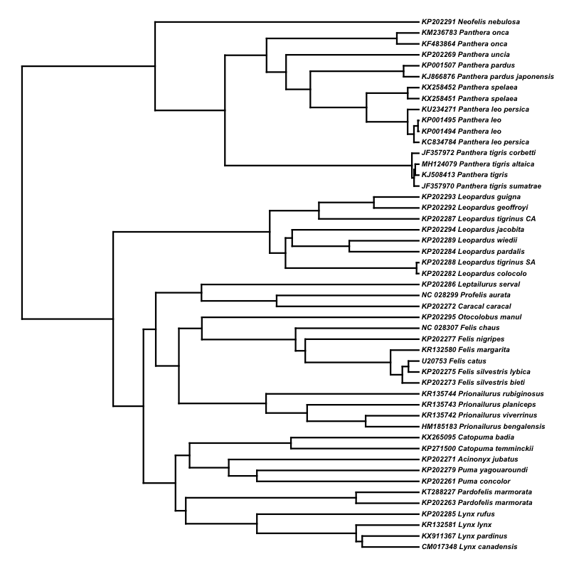
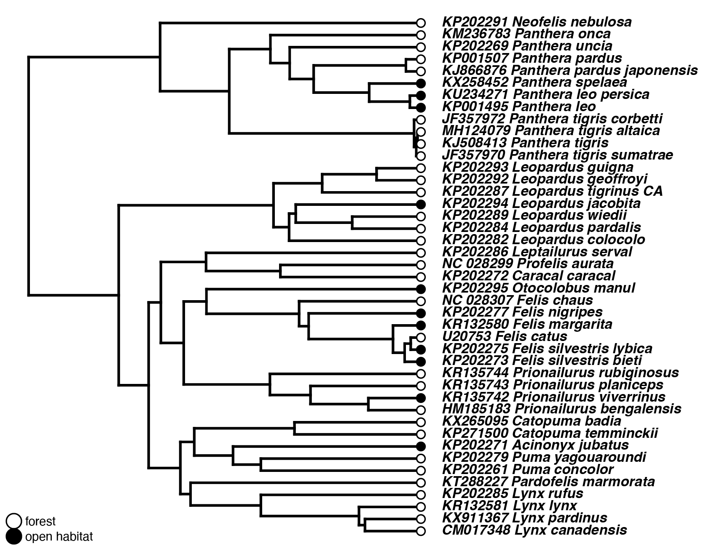

# Analysis of diversification dynamics

Some clades are more species rich than others. Is there an evolutionary reason for this? Does the clade with more species have some features that facilitate speciation or hinder extinction? Diversification dynamics can be studied using timed trees and information about characters. In this tutorial we will first demonstrate how BAMM works. [BAMM](http://bamm-project.org/index.html) is one of the most popular programs for studying diversification dynamics. And then we will do some simple diversification analyses using the R package [`diversitree`](https://besjournals.onlinelibrary.wiley.com/doi/full/10.1111/j.2041-210X.2012.00234.x). 

**BAMM demonstration**

With methods like BAMM, we can use mcmc sampling to model diversification on a given tree. These methods use a birth-death model to sample different speciation and extinction rates and also allow for customization of a lot of other parameters. In the plot below, you can see an example result from a BAMM analysis done with a different dataset. Each panel in the plot shows a different "distinct shift configuration" that was sampled and the title shows the frequency of a particular shift configuration among mcmc samples. Warmer colors represent higher diversification rates and the circles point to a rate shift event.

<p align="center"></p>


It would be possible to analyze our tree with this method too, but for simplicity's sake, we will do our hands-on exercises with the R package `diversitree` today. This will also enable us to study the effect of a binary trait on the diversification dynamics in our tree.


**BiSSE analysis**

We will fit a binary-state speciation and extinction model (BiSSE; [Maddison et al. 2007](https://academic.oup.com/sysbio/article/56/5/701/1694265)) onto our timed-tree and the accompanying habitat preference data for the same tips. Some species of cats are restricted to forests, while others are restricted to open habitats such as savannah, grasslands, or even desserts. A binary character is a character with two states - in our case the two states are the two habitat types. We hypothesise that the ancestral habitat preference for cats is forest habitat and that moving into the open habitat is associated with a change in the diversification rate, which could be positive or negative. We will test this hypothesis and check whether it explains the data better than the null hypothesis, which in this case is that the change in habitat preference is not associated with a change in the diversification rate.

The necessary data for this analysis are the time-calibrated tree and the habitat data. The habitat data is a column in a simple table with taxon names matching tips in our tree and with 0s for forest habitat and 1s for the open habitat (see below for how it should be structured). This table also has body mass data, which we will use in one of the other tutorials.

| Tip.name                            | Organism.name             | habitat | Weight.kg.m | Weight.kg.f |
|-------------------------------------|---------------------------|--------|-------------|-------------|
| CM017348\_Lynx\_canadensis          | Lynx canadensis           | 0      | 10.7        | 8.6         |
| HM185183\_Prionailurus\_bengalensis | Prionailurus bengalensisa | 0      | 2.3         | 1.6         |
| KP202271\_Acinonyx\_jubatus         | Acinonyx jubatus          | 1      | 47          | 39          |
| ...                                 | ...                       | ...    | ...         | ...         |
| ...                                 | ...                       | ...    | ...         | ...         |
| ...                                 | ...                       | ...    | ...         | ...         |
| KP202272\_Caracal\_caracal          | Caracal caracal           | 0      | 13.2        | 10.1        |
| KP202273\_Felis\_silvestris\_bieti  | Felis silvestris bietis   | 1      | 4.8         | 3.9         |
| U20753\_Felis\_catus                | Felis catus               | 0      | 5           | 4           |
| NC\_028299\_Profelis\_aurata        | Profelis aurata           | 0      | 9.7         | 8.5         |
| NC\_028307\_Felis\_chaus            | Felis chaus               | 0      | 8.6         | 5.4         |

You can download the whole table from [here](../../Data/Day3). If you weren't able to get the timed-tree from [Tutorial 6](../6.TimingDivergence), you can get the tree from the same folder as the table.

First we should start by installing the required R package if you haven't done so already. To do that, open RStudio (or launch R the way you normally use it) and type the following command into your console:

```R
install.packages("diversitree")
install.packages("phytools")
```

after making sure you have the package, load it into your environment:

```R
library(diversitree)
library(phytools)
```

Then, we need to load our timed tree and the associated data:

```R
cats.tree = read.nexus("FelidaeTimes.tre")
cats.data = read.csv("FelidaeData.csv", header=T)
```

We will prune the outgroups from our tree first, with the help of the `drop.tip()` function:

```R
outgroups = grep("Hyaena|Herpestes", cats.tree$tip.label, value=T)
cats.tree.ingroup = drop.tip(cats.tree, outgroups,)
```
Then we will plot it quickly to check if everything is alright.

```R
plotTree(cats.tree.ingroup, right=T, fsize=0.4, ftype='i')
```
You should see a tree like the one below:

<p align="center"></p>


Perhaps you have already noticed that we have duplicate tips from several species in our dataset. We will remove them before moving further.
There are five species with exactly the same tip name (after the accession number) and one species with two tips that has either the `_CA` or the `_SA` suffix. 
These two samples are from different populations of the same species and as you can see they position in different places on the tree. 
We will remove the `_SA` tip suspecting that there was a hybridization. 
Four out of five remaining species with duplicate tips appear as clades in the tree, therefore we can remove one of each at random. 
From the last species with duplicate tips, *Panthera leo persica* we will remove `KC834784`.

```R
duplicated_species = names(which(table(cats.data$Organism.name) > 1))
duplicated_tips = sapply(duplicated_species, function(sp){
    this_sp = cats.data[cats.data$Organism.name == sp,"Tip.name"]
})
tips_to_remove = duplicated_tips[1,] 
tips_to_remove = unname(tips_to_remove)
tips_to_remove = c(tips_to_remove, grep("KP202288", cats.data$Tip.name, val=T))
```
The final set of tip names that we will remove should be like the ones below:

```
[1] "KP001494_Panthera_leo"          "KC834784_Panthera_leo_persica"  "KX258451_Panthera_spelaea"      "KF483864_Panthera_onca"        
[5] "KP202263_Pardofelis_marmorata"  "KP202288_Leopardus_tigrinus_SA"
```
Now, let's drop these tips from our tree and subset our accompanying data so that it will only include the tips that are present in our tree.

```R
ct = drop.tip(cats.tree.ingroup, tips_to_remove)

rownames(cats.data) = cats.data$Tip.name
cats.data = cats.data[ct$tip.label,]
cats.forest = setNames(cats.data$forest, cats.data$Tip.name)
head(cats.forest)
```
```
           CM017348_Lynx_canadensis   HM185183_Prionailurus_bengalensis   JF357970_Panthera_tigris_sumatrae 
                                  0                                   0                                   0 
  JF357972_Panthera_tigris_corbetti            KJ508413_Panthera_tigris KJ866876_Panthera_pardus_japonensis 
                                  0                                   0                                   0 
```

Now, let's plot our final tree and the habitat data together so that we can see the overall pattern.

```R
plotTree(ct, ftype='bi', fsize=0.7, offset=0.9, lwd=2)
tiplabels(pie=to.matrix(cats.forest, 0:1)[ct$tip.label,],
          piecol=c("white", "black"), cex=0.3)
legend("bottomleft",c("open habitat","forest"), pch=21,pt.cex=1.6,
cex=0.5,bty="n", pt.bg=c("white","black"))
```

<p align="center"></p>

If you get abnormally large fonts and/or points in your plot, try playing with the `fsize=` and `cex=` parameters in the above code block. Optimal values will be different for different screen resolutions, the size of the plotting area in an Rstudio window, etc. So it's hard to guess a nice value for everyone.

Now that we have the data and the tree ready, we can start with BiSSE.

`make.bisse()` function returns a likelihood function that is proper for BiSSE and our phylogeny. This is a regular R function that expects parameters of a BiSSE model and will return a log likelihood for that set of parameters. In the case of BiSSE, we are optimizing six parameters in total:

+ $\lambda_0$: Speciation rate lambda for the habitat category 0 (forest habitat)
+ $\lambda_1$: Speciation rate lambda for the habitat category 1 (open habitat)
+ $\mu_0$: Extinction rate mu for the habitat category 0
+ $\mu_1$: Extinction rate mu for the habitat category 1
+ $q_{01}$: Rate of switch from forest habitat to open habitat
+ $q_{10}$: Rate of switch from open habitat to forest habitat

`starting.point.bisse()` provides us with a set of starting values for the above parameters. These are needed for us to run a maximum likelihood optimization of our likelihood function.

```R
bisse.model = make.bisse(ct, cats.forest)
p = starting.point.bisse(ct)
```
Try printing out your starting values for the six parameters:

```R
print(p)
```
```
   lambda0    lambda1        mu0        mu1        q01        q10
0.16365895 0.16365895 0.00000000 0.00000000 0.03273179 0.03273179
```

We can start the optimization now with the command shown below. It shouldn't take long for it to complete.

```R
bisse.mle = find.mle(bisse.model, p)
```
we can check the maximum likelihood estimates for our six parameters by:

```R
coef(bisse.mle)
```
```
    lambda0      lambda1          mu0          mu1          q01          q10 
1.209974e-01 2.442066e-01 2.015191e-06 1.539440e-05 5.235873e-02 2.367753e-01 
```
and the log likelihood of our model fit by:

```R
logLik(bisse.mle)
```

Now that we fit our BiSSE model, we should fit our null model, which is the model we will test our BiSSE model against.
We will do that by modifying the likelihood function we created for BiSSE, which was saved to a variable called `bisse.model`.

```R
bissenull.model = constrain(bisse.model,lambda1~lambda0,mu1~mu0)
bissenull.mle = find.mle(bissenull.model, p[c(-2,-4)])
```
Here, we used the `constrain()` function, which will force $\lambda_0 = \lambda_1$ and $\mu_0 = \mu_1$ essentially making this new speciation-extinction model habitat independent. Then we use `find.mle()` as before. To statistically test whether the BiSSE model is a better fit then the null model, we are going to do a [Likelihood-ratio test](https://evomics.org/resources/likelihood-ratio-test/). Luckily, it is really easy to do thanks to the provided `anova()` method for BiSSE fit class objects (results of `fit.mle()` on bisse models). Let's try it:

```R
anova(bisse.mle, null=bissenull.mle)
```

```
     Df   lnLik    AIC  ChiSq Pr(>|Chi|)
full  6 -135.79 283.58                  
null  4 -136.80 281.60 2.0233     0.3636
```

The log likelihood for the BiSSE model is a little better than the log likelihood for the null model. However, is that a significant difference? The last column in this table shows the p-value. In this case, we cannot reject our null hypothesis. In other words, the BiSSE model, which hypothesised that the diversification rate changed with a change in habitat preference, is not a better fit to our data than the null hypothesis. In other words, these two models can explain our data equally well. This means that we cannot say that there the diversification pattern in our tree can be explained by the species' habitat preference.

------------------
Now that we are done with this tutorial, we can save our pruned tree and the trimmed data object so that we can have them ready to use if we need them again.

```R
write.tree(ct, "FelidaeTimes_pruned.tre")
write.csv(cats.data, file='FelidaeData_subset.csv', quote=F, row.names=F)
```
